# TenYun

Promise based and chained Tencent Cloud OpenAPI client for NodeJS

[](https://github.com/TheNorthMemory/tenyun/releases)
[](https://snyk.io/advisor/npm-package/tenyun)
[](https://www.npmjs.com/package/tenyun)
[](https://www.npmjs.com/package/tenyun)
[](https://www.npmjs.com/package/tenyun)
[](https://www.npmjs.com/package/tenyun)

## 设计

核心包通过实例化后两次`Proxy`动态代理，第一层代理 `产品标识`，第二层代理`产品服务` 实现了通过一个实例接入腾讯云各产品服务的能力，默认为`最新`版本的接口接入，同时提供`往期`版本(通过第二参数传递`X-TC-Version`头)的接入能力。

[](./.github/sdk-flowchart.mmd)

## 使用

`npm install tenyun`

```js
import TenYun from 'tenyun';

const secretId = 'AKIDz8krbsJ5yKBZQpn74WFkmLPx3*******';
const secretKey = 'Gu5t9xGARNpq86cd98joQYCN3*******';

const tc = new TenYun(secretId, secretKey);

const sampleRequest = {Limit: 1, Filters: [ { Values: [ '未命名' ], Name: 'instance-name' } ]};

tc.cvm.DescribeInstances(sampleRequest)
.then(({ data }) => console.info(data))
.catch((error) => console.error(error.code));

(async () => {
  try {
    const { data } = await tc.cvm.DescribeInstances(sampleRequest);
    console.info(data);
  } catch(error) {
    console.error(error);
  }
})();

// provide the second object, AKA AxiosRequestConfig, to request the specific `X-TC-Version` API
tc.sms.DescribeSmsSignList({ SignIdSet: [123], International: 0 }, { headers: { 'X-TC-Version': '2019-07-11' } })
.then(({ data }) => console.info(data))
.catch((error) => console.error(error.code));

// none documentation APIs
tc.tcbr.DescribeArchitectureType()
.then(({ data }) => console.info(data))
.catch((error) => console.error(error.code));

console.info(tc);

TenYun {
  cvm: [Function: cvm.tencentcloudapi.com] {
    DescribeInstances: [AsyncFunction: DescribeInstances]
  },
  sms: [Function: sms.tencentcloudapi.com] {
    DescribeSmsSignList: [AsyncFunction: DescribeSmsSignList]
  },
  tcbr: [Function: tcbr.tencentcloudapi.com] {
    DescribeArchitectureType: [AsyncFunction: DescribeArchitectureType]
  },
  [Symbol(SECRET_ID)]: 'AKIDz8krbsJ5yKBZQpn74WFkmLPx3*******',
  [Symbol(SECRET_KEY)]: SecretKeyObject { [Symbol(kKeyType)]: 'secret' }
}
```

## API

**`new TenYun(SecretId: string, SecretKey: BinaryLike, Token?: string, Region?: string)`**

| 参数 | 类型 | 说明 |
| --- | --- | --- |
| SecretId | <code>string</code> | 密钥ID |
| SecretKey | <code>BinaryLike</code> | 密钥 |
| Token | <code>string</code> | 临时安全凭证(可选) |
| Region | <code>string</code> | 地域参数(可选) |

**`tenYun[ServiceShortName]() => string[]`**

返回支持的服务版本 `YYYY-MM-DD` 格式字符串数组，`DESC` 排序。

**`tenYun[ServiceShortName][ActionName](data?: any, config?: AxiosRequestConfig) => AxiosPromise`**

请求对应产品的服务。

**`tenYun.client => AxiosInstance`**

返回 `Axios` 实例。


## 支持的产品及服务

<details><summary>共计 256+ 款产品，11729+ 服务数</summary>

产品标识 | 产品说明 | 最新版本(数) | 历史版本(数)
--- | --- | --- | ---
aa | [活动防刷](https://cloud.tencent.com/document/product/1189) | 2020-02-24(1) |
aai |  | 2018-05-22(4) |
acp | [应用合规平台](https://cloud.tencent.com/document/product/1553) | 2022-01-05(8) |
advisor | [云顾问](https://cloud.tencent.com/document/product/1264) | 2020-07-21(2) |
af | [借贷反欺诈](https://cloud.tencent.com/document/product/668) | 2020-02-26(3) |
afc | [定制建模](https://cloud.tencent.com/document/product/1029) | 2020-02-26(3) |
aiart | [大模型图像创作引擎](https://cloud.tencent.com/document/product/1668) | 2022-12-29(13) |
ame | [正版曲库直通车](https://cloud.tencent.com/document/product/1155) | 2019-09-16(31) |
ams | [音频内容安全](https://cloud.tencent.com/document/product/1219) | 2020-12-29(5) | 2020-06-08(7) |
anicloud | [动效素材服务](https://cloud.tencent.com/document/product/1641) | 2022-09-23(3) |
antiddos | [T-Sec-DDoS防护(Anti-DDoS)](https://cloud.tencent.com/document/product/1021) | 2020-03-09(96) |
apcas | [汽车精准获客服务](https://cloud.tencent.com/document/product/1244) | 2020-11-27(7) |
ape | [正版图库直通车](https://cloud.tencent.com/document/product/1181) | 2020-05-13(8) |
api | [云 API](https://cloud.tencent.com/document/product/1278) | 2020-11-06(3) |
apigateway | [API 网关](https://cloud.tencent.com/document/product/628) | 2018-08-08(97) |
apm | [应用性能监控](https://cloud.tencent.com/document/product/1463) | 2021-06-22(12) |
asr | [语音识别](https://cloud.tencent.com/document/product/1093) | 2019-06-14(32) |
asw | [应用与服务编排工作流](https://cloud.tencent.com/document/product/1272) | 2020-07-22(9) |
as | [弹性伸缩](https://cloud.tencent.com/document/product/377) | 2018-04-19(57) |
ba | [ICP备案](https://cloud.tencent.com/document/product/243) | 2020-07-20(3) |
batch | [批量计算](https://cloud.tencent.com/document/product/599) | 2017-03-12(31) |
bda | [人体分析](https://cloud.tencent.com/document/product/1208) | 2020-03-24(18) |
bi | [商业智能分析 BI](https://cloud.tencent.com/document/product/590) | 2022-01-05(22) |
billing | [费用中心](https://cloud.tencent.com/document/product/555) | 2018-07-09(45) |
bizlive | 商业直播 | 2019-03-13(6) |
bm | [黑石物理服务器CPM](https://cloud.tencent.com/document/product/386) | 2018-04-23(53) |
bma | [品牌经营管家](https://cloud.tencent.com/document/product/1296) | 2022-11-15(11) | 2021-06-24(28) |
bmeip | [黑石弹性公网IP](https://cloud.tencent.com/document/product/1028) | 2018-06-25(20) |
bmlb | [黑石负载均衡](https://cloud.tencent.com/document/product/1027) | 2018-06-25(49) |
bmvpc | [黑石私有网络](https://cloud.tencent.com/document/product/1024) | 2018-06-25(61) |
bpaas | [商业流程服务](https://cloud.tencent.com/document/product/1083) | 2018-12-17(2) |
bri | [业务风险情报](https://cloud.tencent.com/document/product/1064) | 2019-03-28(1) |
bsca | [二进制软件成分分析](https://cloud.tencent.com/document/product/1483) | 2021-08-11(7) |
btoe | [区块链可信取证](https://cloud.tencent.com/document/product/1259) | 2021-05-14(13) | 2021-03-03(12) |
ca | [腾讯云CA](https://cloud.tencent.com/document/product/1691) | 2023-02-28(3) |
cam | [访问管理](https://cloud.tencent.com/document/product/598) | 2019-01-16(90) |
captcha | [验证码](https://cloud.tencent.com/document/product/1110) | 2019-07-22(18) |
car | [应用云渲染](https://cloud.tencent.com/document/product/1547) | 2022-01-10(6) |
cat | [云拨测](https://cloud.tencent.com/document/product/280) | 2018-04-09(12) |
cbs | [云硬盘](https://cloud.tencent.com/document/product/362) | 2017-03-12(42) |
ccc | [云联络中心](https://cloud.tencent.com/document/product/679) | 2020-02-10(61) |
cdb | [云数据库 MySQL](https://cloud.tencent.com/document/product/236) | 2017-03-20(170) |
cdc | [本地专用集群](https://cloud.tencent.com/document/product/1346) | 2020-12-14(21) |
cdn | [内容分发网络 CDN](https://cloud.tencent.com/document/product/228) | 2018-06-06(81+3) |
cds | [T-Sec-数据安全审计（DSA）](https://cloud.tencent.com/document/product/856) | 2018-04-20(5) |
cdwch | [腾讯云数据仓库TCHouse-C](https://cloud.tencent.com/document/product/1299) | 2020-09-15(27) |
cdwdoris | [腾讯云数据仓库 TCHouse-D](https://cloud.tencent.com/document/product/1387) | 2021-12-28(60) |
cdwpg | [云数据仓库 PostgreSQL](https://cloud.tencent.com/document/product/878) | 2020-12-30(8) |
cdz | [专属可用区](https://cloud.tencent.com/document/product/1629) | 2022-11-23(2) |
cfg | [混沌演练平台](https://cloud.tencent.com/document/product/1500) | 2021-08-20(16) |
cfs | [文件存储](https://cloud.tencent.com/document/product/582) | 2019-07-19(43) |
cfw | [云防火墙](https://cloud.tencent.com/document/product/1132) | 2019-09-04(115) |
chdfs | [云 HDFS](https://cloud.tencent.com/document/product/1105) | 2020-11-12(29) | 2019-07-18(26) |
ciam | [账号风控平台](https://cloud.tencent.com/document/product/1441) | 2022-03-31(23) |
cii | [智能保险助手](https://cloud.tencent.com/document/product/1368) | 2021-04-08(13) | 2020-12-10(3) |
cim |  | 2019-03-18(1) |
cis |  | 2018-04-08(7) |
ckafka | [消息队列 CKafka 版](https://cloud.tencent.com/document/product/597) | 2019-08-19(85) |
clb | [负载均衡](https://cloud.tencent.com/document/product/214) | 2018-03-17(86) |
cloudapp | [云应用](https://cloud.tencent.com/document/product/1689) | 2022-05-30(1) |
cloudaudit | [操作审计](https://cloud.tencent.com/document/product/629) | 2019-03-19(19) |
cloudhsm | [云加密机](https://cloud.tencent.com/document/product/639) | 2019-11-12(14) |
cloudstudio | [Cloud Studio（云端 IDE）](https://cloud.tencent.com/document/product/1039) | 2023-05-08(9) |
cls | [日志服务](https://cloud.tencent.com/document/product/614) | 2020-10-16(101) |
cme | [多媒体创作引擎](https://cloud.tencent.com/document/product/1156) | 2019-10-29(50) |
cmq | [消息队列 CMQ](https://cloud.tencent.com/document/product/406) | 2019-03-04(17) |
cms | 内容安全 | 2019-03-21(6) |
config | [配置审计](https://cloud.tencent.com/document/product/1579) | 2022-08-02(3) |
controlcenter | [控制中心](https://cloud.tencent.com/document/product/1708) | 2023-01-10(1) |
cpdp | [企业收付平台](https://cloud.tencent.com/document/product/1122) | 2019-08-20(219) |
cr | [金融联络机器人](https://cloud.tencent.com/document/product/656) | 2018-03-21(28) |
csip | [云安全一体化平台](https://cloud.tencent.com/document/product/664) | 2022-11-21(43) |
csxg | [5G入云服务](https://cloud.tencent.com/document/product/1687) | 2023-03-03(5) |
cvm | [云服务器](https://cloud.tencent.com/document/product/213) | 2017-03-12(101) |
cwp | [主机安全](https://cloud.tencent.com/document/product/296) | 2018-02-28(516) |
cws | 漏洞扫描服务 | 2018-03-12(19) |
cynosdb | [TDSQL-C MySQL 版](https://cloud.tencent.com/document/product/1003) | 2019-01-07(149) |
dasb | [运维安全中心（堡垒机）](https://cloud.tencent.com/document/product/1025) | 2019-10-18(63) |
dataintegration | [数据接入平台](https://cloud.tencent.com/document/product/1591) | 2022-06-13(1) |
dayu | [DDoS 高防包](https://cloud.tencent.com/document/product/1021) | 2018-07-09(112) |
dbbrain | [数据库智能管家 DBbrain](https://cloud.tencent.com/document/product/1130) | 2021-05-27(63) | 2019-10-16(27) |
dbdc | [云数据库独享集群](https://cloud.tencent.com/document/product/1322) | 2020-10-29(6) |
dc | [专线接入](https://cloud.tencent.com/document/product/216) | 2018-04-10(21) |
dcdb | [TDSQL MySQL 版](https://cloud.tencent.com/document/product/557) | 2018-04-11(76) |
dlc | [数据湖计算 DLC](https://cloud.tencent.com/document/product/1342) | 2021-01-25(143) |
dnspod | [DNSPod](https://cloud.tencent.com/document/product/1427) | 2021-03-23(75) |
domain | [域名注册](https://cloud.tencent.com/document/product/242) | 2018-08-08(55) |
drm | [数字版权管理](https://cloud.tencent.com/document/product/1000) | 2018-11-15(11) |
ds | [文档服务](https://cloud.tencent.com/document/product/869) | 2018-05-23(12) |
dsgc | [数据安全治理中心](https://cloud.tencent.com/document/product/1087) | 2019-07-23(148) |
dtf | [分布式事务](https://cloud.tencent.com/document/product/1224) | 2020-05-06(1) |
dts | [数据传输服务](https://cloud.tencent.com/document/product/571) | 2021-12-06(71) | 2018-03-30(22) |
eb | [事件总线](https://cloud.tencent.com/document/product/1359) | 2021-04-16(32) |
ecc | [英文作文批改](https://cloud.tencent.com/document/product/1076) | 2018-12-13(4) |
ecdn | [全站加速网络](https://cloud.tencent.com/document/product/570) | 2019-10-12(16) |
ecm | [边缘计算机器](https://cloud.tencent.com/document/product/1108) | 2019-07-19(139) |
eiam | [数字身份管控平台（员工版）](https://cloud.tencent.com/document/product/1442) | 2021-04-20(42) |
eis | [数据连接器](https://cloud.tencent.com/document/product/1270) | 2021-06-01(5) | 2020-07-15(3) |
emr | [弹性 MapReduce](https://cloud.tencent.com/document/product/589) | 2019-01-03(61) |
es | [Elasticsearch Service](https://cloud.tencent.com/document/product/845) | 2018-04-16(57) |
ess | [腾讯电子签企业版](https://cloud.tencent.com/document/product/1323) | 2020-11-11(93) |
essbasic | [腾讯电子签（基础版）](https://cloud.tencent.com/document/product/1420) | 2021-05-26(79) | 2020-12-22(53) |
facefusion | [人脸融合](https://cloud.tencent.com/document/product/670) | 2022-09-27(3) | 2018-12-01(3) |
faceid | [人脸核身](https://cloud.tencent.com/document/product/1007) | 2018-03-01(37) |
fmu | [人脸试妆](https://cloud.tencent.com/document/product/1172) | 2019-12-13(10) |
ft | [人像变换](https://cloud.tencent.com/document/product/1202) | 2020-03-04(6) |
gaap | [全球应用加速](https://cloud.tencent.com/document/product/608) | 2018-05-29(105) |
gme | [游戏多媒体引擎](https://cloud.tencent.com/document/product/607) | 2018-07-11(28) |
goosefs | [数据加速器 GooseFS](https://cloud.tencent.com/document/product/1424) | 2022-05-19(20) |
gpm | [游戏玩家匹配](https://cloud.tencent.com/document/product/1294) | 2020-08-20(18) |
gs | [云游戏](https://cloud.tencent.com/document/product/1162) | 2019-11-18(9) |
gse | [游戏服务器伸缩](https://cloud.tencent.com/document/product/1165) | 2019-11-12(74) |
habo |  | 2018-12-03(2) |
hai | [高性能应用服务](https://cloud.tencent.com/document/product/1721) | 2023-08-12(11) |
hasim | [高可用物联网卡](https://cloud.tencent.com/document/product/1482) | 2021-07-16(22) |
hcm | [数学作业批改](https://cloud.tencent.com/document/product/1004) | 2018-11-06(1) |
hunyuan | [腾讯混元大模型](https://cloud.tencent.com/document/product/1729) | 2023-09-01(10) |
iai | [人脸识别](https://cloud.tencent.com/document/product/867) | 2020-03-03(35) | 2018-03-01(33) |
ic | [图片瘦身](https://cloud.tencent.com/document/product/636) | 2019-03-07(9) |
icr | [对话机器人](https://cloud.tencent.com/document/product/1268) | 2021-10-14(1) |
ie | [智能编辑](https://cloud.tencent.com/document/product/1186) | 2020-03-04(10) |
iecp | [物联网边缘计算平台](https://cloud.tencent.com/document/product/1118) | 2021-09-14(82) |
iir | [智能识图](https://cloud.tencent.com/document/product/1217) | 2020-04-17(1) |
ims | [图片内容安全](https://cloud.tencent.com/document/product/1125) | 2020-12-29(2) | 2020-07-13(1) |
ioa | [iOA 零信任安全管理系统](https://cloud.tencent.com/document/product/1092) | 2022-06-01(4) |
iot | [加速物联网套件](https://cloud.tencent.com/document/product/568) | 2018-01-23(45) |
iotcloud | [物联网通信](https://cloud.tencent.com/document/product/634) | 2021-04-08(73) | 2018-06-14(69) |
iotexplorer | [物联网开发平台](https://cloud.tencent.com/document/product/1081) | 2019-04-23(143) |
iottid | [物联网设备身份认证](https://cloud.tencent.com/document/product/1086) | 2019-04-11(9) |
iotvideo | [物联网智能视频服务](https://cloud.tencent.com/document/product/1131) | 2021-11-25(102) | 2020-12-15(79)<br/>2019-11-26(66) |
iotvideoindustry | [物联网智能视频服务（行业版）](https://cloud.tencent.com/document/product/1361) | 2020-12-01(104) |
irp | [智能推荐平台](https://cloud.tencent.com/document/product/1541) | 2022-08-05(7) | 2022-03-24(4) |
iss | [智能视图计算平台](https://cloud.tencent.com/document/product/1344) | 2023-05-17(85) |
ivld | [媒体智能标签](https://cloud.tencent.com/document/product/1509) | 2021-09-03(28) |
keewidb | [云数据库 KeeWiDB](https://cloud.tencent.com/document/product/1520) | 2022-03-08(38) |
kms | [密钥管理系统](https://cloud.tencent.com/document/product/573) | 2019-01-18(53) |
lcic | [实时互动-教育版](https://cloud.tencent.com/document/product/1639) | 2022-08-17(62) |
lighthouse | [轻量应用服务器](https://cloud.tencent.com/document/product/1207) | 2020-03-24(109) |
live | [云直播CSS](https://cloud.tencent.com/document/product/267) | 2018-08-01(156) |
lke | [大模型知识引擎](https://cloud.tencent.com/document/product/1759) | 2023-11-30(90) |
lowcode | [云开发低码](https://cloud.tencent.com/document/product/1301) | 2021-01-08(1) |
lp | [登录保护](https://cloud.tencent.com/document/product/1190) | 2020-02-24(1) |
mall | [商场客留大数据](https://cloud.tencent.com/document/product/1707) | 2023-05-18(1) |
mariadb | [云数据库 MariaDB](https://cloud.tencent.com/document/product/237) | 2017-03-12(77) |
market | [云市场](https://cloud.tencent.com/document/product/306) | 2019-10-10(2) |
memcached | [云数据库Memcached](https://cloud.tencent.com/document/product/241) | 2019-03-18(1) |
mgobe | [游戏联机对战引擎](https://cloud.tencent.com/document/product/1038) | 2020-10-14(7) | 2019-09-29(1) |
mmps | [小程序安全](https://cloud.tencent.com/document/product/1223) | 2020-07-10(15) |
mna | [多网聚合加速](https://cloud.tencent.com/document/product/1385) | 2021-01-19(41) |
mongodb | [云数据库 MongoDB](https://cloud.tencent.com/document/product/240) | 2019-07-25(49) | 2018-04-08(13) |
monitor | [腾讯云可观测平台](https://cloud.tencent.com/document/product/248) | 2018-07-24(155) |
mps | [媒体处理](https://cloud.tencent.com/document/product/862) | 2019-06-12(104) |
mqtt | [消息队列 MQTT 版](https://cloud.tencent.com/document/product/1778) | 2024-05-16(19) |
mrs | [医疗报告结构化](https://cloud.tencent.com/document/product/1314) | 2020-09-10(11) |
ms | [移动应用安全](https://cloud.tencent.com/document/product/283) | 2018-04-08(23) |
msp | [迁移服务平台](https://cloud.tencent.com/document/product/659) | 2018-03-19(7) |
mvj | 营销价值判断 | 2019-09-26(1) |
nlp | [NLP 服务](https://cloud.tencent.com/document/product/271) | 2019-04-08(12) |
npp | 号码保护 | 2019-08-23(8) |
oceanus | [流计算 Oceanus](https://cloud.tencent.com/document/product/849) | 2019-04-22(38) |
ocr | [文字识别](https://cloud.tencent.com/document/product/866) | 2018-11-19(87) |
omics | [腾讯健康组学平台](https://cloud.tencent.com/document/product/1643) | 2022-11-28(20) |
open | 腾讯云 OAuth | 2018-12-25(2) |
organization | [集团账号管理](https://cloud.tencent.com/document/product/850) | 2021-03-31(118) | 2018-12-25(20) |
partners | [渠道合作伙伴](https://cloud.tencent.com/document/product/563) | 2018-03-21(19) |
pds | [私域安全](https://cloud.tencent.com/document/product/1473) | 2021-07-01(2) |
postgres | [云数据库 PostgreSQL](https://cloud.tencent.com/document/product/409) | 2017-03-12(101) |
privatedns | [私有域解析 Private DNS](https://cloud.tencent.com/document/product/1338) | 2020-10-28(25) |
pts | [云压测](https://cloud.tencent.com/document/product/1484) | 2021-07-28(48) |
rce | [全栈式风控引擎](https://cloud.tencent.com/document/product/1343) | 2020-11-03(10) |
redis | [云数据库Redis](https://cloud.tencent.com/document/product/239) | 2018-04-12(106) |
region | [地域管理系统](https://cloud.tencent.com/document/product/1596) | 2022-06-27(3) |
rkp | [风险探针](https://cloud.tencent.com/document/product/1169) | 2019-12-09(3) |
rp | [注册保护](https://cloud.tencent.com/document/product/1191) | 2020-02-24(1) |
rum | [前端性能监控](https://cloud.tencent.com/document/product/1464) | 2021-06-22(54) |
scf | [云函数](https://cloud.tencent.com/document/product/583) | 2018-04-16(46+7) |
ses | [邮件推送](https://cloud.tencent.com/document/product/1288) | 2020-10-02(31) |
smh | [智能媒资托管](https://cloud.tencent.com/document/product/1339) | 2021-07-12(15) |
smop | [腾讯安心用户运营平台](https://cloud.tencent.com/document/product/1310) | 2020-12-03(1) |
smpn | [营销号码安全](https://cloud.tencent.com/document/product/1127) | 2019-08-22(2) |
sms | [短信](https://cloud.tencent.com/document/product/382) | 2021-01-11(18) | 2019-07-11(16) |
soe | [智聆口语评测](https://cloud.tencent.com/document/product/884) | 2018-07-24(4) |
solar | 智汇零售 | 2018-10-11(17) |
sqlserver | [云数据库 SQL Server](https://cloud.tencent.com/document/product/238) | 2018-03-28(148) |
ssa | [安全运营中心](https://cloud.tencent.com/document/product/664) | 2018-06-08(23) |
ssl | [SSL 证书](https://cloud.tencent.com/document/product/400) | 2019-12-05(60) |
sslpod | [证书监控 SSLPod](https://cloud.tencent.com/document/product/1084) | 2019-06-05(10) |
ssm | [凭据管理系统](https://cloud.tencent.com/document/product/1140) | 2019-09-23(24) |
sts | [安全凭证服务](https://cloud.tencent.com/document/product/1312) | 2018-08-13(6) |
svp | [节省计划](https://cloud.tencent.com/document/product/1761) | 2024-01-25(4) |
taf | [流量反欺诈](https://cloud.tencent.com/document/product/1031) | 2020-02-10(4) |
tag | [标签](https://cloud.tencent.com/document/product/651) | 2018-08-13(31) |
tan | [碳引擎](https://cloud.tencent.com/document/product/1498) | 2022-04-20(1) |
tat | [自动化助手](https://cloud.tencent.com/document/product/1340) | 2020-10-28(29) |
tav | 文件检测 | 2019-01-18(4) |
tbaas | [腾讯云区块链服务平台 TBaaS](https://cloud.tencent.com/document/product/663) | 2018-04-16(25) |
tbm |  | 2018-01-29(9) |
tbp | [腾讯智能对话平台](https://cloud.tencent.com/document/product/1060) | 2019-06-27(2) | 2019-03-11(4) |
tcaplusdb | [游戏数据库 TcaplusDB](https://cloud.tencent.com/document/product/596) | 2019-08-23(53) |
tcb | [云开发 CloudBase](https://cloud.tencent.com/document/product/876) | 2018-06-08(89+195) |
tcbr | [云托管 CloudBase Run](https://cloud.tencent.com/document/product/1243) | 2022-02-17(10+10) |
tcex | [腾讯云释义](https://cloud.tencent.com/document/product/1266) | 2020-07-27(2) |
tchd | [腾讯云健康看板](https://cloud.tencent.com/document/product/1688) | 2023-03-06(1) |
tci | 腾讯智学课堂分析 | 2019-03-18(41) |
tcm | [服务网格](https://cloud.tencent.com/document/product/1261) | 2021-04-13(12) |
tcr | [容器镜像服务](https://cloud.tencent.com/document/product/1141) | 2019-09-24(110) |
tcss | [容器安全服务](https://cloud.tencent.com/document/product/1285) | 2020-11-01(338) |
tdcpg | [TDSQL-C PostgreSQL 版](https://cloud.tencent.com/document/product/1556) | 2021-11-18(25) |
tdid | [分布式身份](https://cloud.tencent.com/document/product/1439) | 2021-05-19(18) |
tdmq | [消息队列 TDMQ](https://cloud.tencent.com/document/product/1179) | 2020-02-17(142) |
tds | [设备安全](https://cloud.tencent.com/document/product/1628) | 2022-08-01(4) |
tem | [弹性微服务](https://cloud.tencent.com/document/product/1371) | 2021-07-01(50) | 2020-12-21(17) |
teo | [边缘安全加速平台](https://cloud.tencent.com/document/product/1552) | 2022-09-01(117) | 2022-01-06(5) |
thpc | [高性能计算平台](https://cloud.tencent.com/document/product/1527) | 2023-03-21(23) | 2022-04-01(16)<br/>2021-11-09(4) |
tia | [智能钛机器学习](https://cloud.tencent.com/document/product/851) | 2018-02-26(10) |
tic | [资源编排 TIC](https://cloud.tencent.com/document/product/1213) | 2020-11-17(13) |
ticm | [智能鉴黄](https://cloud.tencent.com/document/product/864) | 2018-11-27(3) |
tics | [威胁情报云查服务](https://cloud.tencent.com/document/product/1013) | 2018-11-15(4) |
tiems | [腾讯云 TI 平台 TI-EMS](https://cloud.tencent.com/document/product/1120) | 2019-04-16(25) |
tiia | [图像分析](https://cloud.tencent.com/document/product/865) | 2019-05-29(22) |
tione | [TI-ONE 训练平台](https://cloud.tencent.com/document/product/851) | 2021-11-11(38) | 2019-10-22(22) |
tiw | [互动白板](https://cloud.tencent.com/document/product/1137) | 2019-09-19(60) |
tke | [容器服务](https://cloud.tencent.com/document/product/457) | 2022-05-01(11) | 2018-05-25(226) |
tkgdq | [腾讯知识图谱数据查询](https://cloud.tencent.com/document/product/1072) | 2019-04-11(3) |
tms | [文本内容安全](https://cloud.tencent.com/document/product/1124) | 2020-12-29(2) | 2020-07-13(4) |
tmt | [机器翻译](https://cloud.tencent.com/document/product/551) | 2018-03-21(7) |
tourism | [文旅客情大数据](https://cloud.tencent.com/document/product/1684) | 2023-02-15(1) |
trdp | [流量风险决策平台](https://cloud.tencent.com/document/product/1604) | 2022-07-26(1) |
trocket | [消息队列 RocketMQ 版](https://cloud.tencent.com/document/product/1493) | 2023-03-08(49) |
trp | [T-Sec-安心平台(RP)](https://cloud.tencent.com/document/product/1458) | 2021-05-15(54) |
trro | [远程实时操控](https://cloud.tencent.com/document/product/1584) | 2022-03-25(23) |
trtc | [实时音视频](https://cloud.tencent.com/document/product/647) | 2019-07-22(56) |
tse | [微服务引擎](https://cloud.tencent.com/document/product/1364) | 2020-12-07(112) |
tsf | [微服务平台 TSF](https://cloud.tencent.com/document/product/649) | 2018-03-26(222) |
tsi | [腾讯同传系统](https://cloud.tencent.com/document/product/1399) | 2021-03-25(3) |
tsw | [微服务观测平台 TSW](https://cloud.tencent.com/document/product/1311) | 2021-04-12(3) | 2020-09-24(1) |
tts | [语音合成](https://cloud.tencent.com/document/product/1073) | 2019-08-23(3) |
ump | [客流数字化平台](https://cloud.tencent.com/document/product/1320) | 2020-09-18(17) |
vcg | [视频生成](https://cloud.tencent.com/document/product/1770) | 2024-04-04(2) |
vclm | [大模型视频创作引擎](https://cloud.tencent.com/document/product/1616) | 2024-05-23(9) |
vdb | [向量数据库](https://cloud.tencent.com/document/product/1709) | 2023-06-16(6) |
vm | [视频内容安全](https://cloud.tencent.com/document/product/1265) | 2021-09-22(4) | 2020-12-29(4)<br/>2020-07-09(5) |
vms | [语音消息](https://cloud.tencent.com/document/product/1128) | 2020-09-02(2) |
vod | [云点播](https://cloud.tencent.com/document/product/266) | 2024-07-18(1) | 2018-07-17(180) |
vpc | [私有网络](https://cloud.tencent.com/document/product/215) | 2017-03-12(370) |
vrs | [声音复刻](https://cloud.tencent.com/document/product/1283) | 2020-08-24(7) |
vtc | [视频转译](https://cloud.tencent.com/document/product/1769) | 2024-02-23(3) |
waf | [Web 应用防火墙](https://cloud.tencent.com/document/product/627) | 2018-01-25(141) |
wav | [企业微信汽车行业版](https://cloud.tencent.com/document/product/1318) | 2021-01-29(26) |
wedata | [数据开发治理平台 WeData](https://cloud.tencent.com/document/product/1267) | 2021-08-20(233) |
weilingwith | [微瓴同业开放平台](https://cloud.tencent.com/document/product/1693) | 2023-04-27(64) |
wss | SSL证书管理服务 | 2018-04-26(3) |
yinsuda | [音速达直播音乐版权引擎](https://cloud.tencent.com/document/product/1592) | 2022-05-27(20) |
youmall |  | 2018-02-28(31) |
yunjing | 主机安全 | 2018-02-28(100) |
yunsou | [腾讯云搜TCS](https://cloud.tencent.com/document/product/270) | 2019-11-15(2) | 2018-05-04(2) |

</details>

## 其他

[types](./types/) 基于 [tencentcloud-cli:services](https://github.com/TencentCloud/tencentcloud-cli/tree/master/tccli/services) 及 [@wxcloud/cloudapi](https://www.npmjs.com/package/@wxcloud/cloudapi) 项目生成，其中 [vpc.d.ts](./types/vpc.d.ts) 及 [tag.d.ts](./types/tag.d.ts) 遵循如下生成规则：`vpc:$.objects.Vpc` 对象在本项目内别名为 `interface VpcInfo` ，`tag:$.objects.Tag` 别名为 `interface TagInfo` ，以消除与模块`module`重名而产生的歧义。

## License

[MIT](LICENSE)
